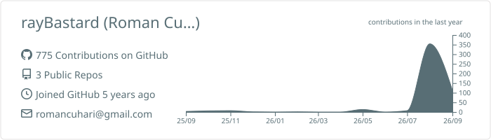
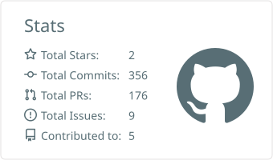
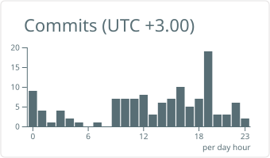

# Hey, I'm Roman Cuhari (aka rayBastard) 👋

**Senior full-stack developer** from Moldova 🇲🇩 — core contributor at **[CCXT](https://github.com/ccxt/ccxt)**, the cryptocurrency exchange trading library used by thousands of trading bots and fintech products.

> 🏆 **85+ merged PRs** · **top-25 of 350+ contributors** at [ccxt/ccxt](https://github.com/ccxt/ccxt/graphs/contributors) · contributing since 2024

## 🔧 What I do at CCXT

CCXT is a single TypeScript codebase transpiled to **JavaScript, Python, PHP, C#, Go and Java** — every change has to work identically in six languages. My contributions include:

- 🏗️ **New exchange integrations built from scratch:** [Deepcoin](https://github.com/ccxt/ccxt/blob/master/ts/src/deepcoin.ts), [HashKey](https://github.com/ccxt/ccxt/blob/master/ts/src/hashkey.ts), [Coincatch](https://github.com/ccxt/ccxt/pull/23589), [OX.FUN](https://github.com/ccxt/ccxt/pull/22354)
- ⚡ **WebSocket (ccxt.pro) implementations:** real-time orderbooks, trades, balances and orders for TradeOgre, LBank, XT, WhiteBIT and more
- 🎲 **Prediction-market integrations:** [Opinion](https://github.com/ccxt/ccxt/blob/master/ts/src/prediction/opinion.ts), [sx.bet](https://github.com/ccxt/ccxt/pull/29449) (WebSocket via Centrifugo, in review)
- 🔍 **Deep exchange audits** — endpoint-by-endpoint verification against live APIs with static-fixture regression tests: WhiteBIT, XT, WOO / WOOFi Pro, WEEX, Toobit, Poloniex, Kraken Futures
- 📈 **Advanced trading features:** trailing stops, trigger & TP/SL orders, margin/position management, sandbox & demo-trading modes
- 🛠️ **Unified API maintenance** across dozens of exchanges: Binance, OKX, KuCoin, Kraken, Bitstamp, BitMart, HTX…

## 🔀 Latest merged PRs in ccxt/ccxt

<!-- CCXT-PRS:START -->
- [fix(upbit): do not default unknown order side to sell](https://github.com/ccxt/ccxt/pull/30012) · 2026-08-22
- [fix(tokocrypto): route fetchTrades by symbol type and await the open/v1 response](https://github.com/ccxt/ccxt/pull/30013) · 2026-08-21
- [fix(phemex): correct fetchPositionsADLRank jsdoc name and unify scale getters](https://github.com/ccxt/ccxt/pull/29985) · 2026-08-20
- [fix(phemex): apply amount precision to swap order quantity in createOrder](https://github.com/ccxt/ccxt/pull/29967) · 2026-08-19
- [fix(poloniex): map unified clientOrderId to clOrdId for swap orders](https://github.com/ccxt/ccxt/pull/29966) · 2026-08-19
<!-- CCXT-PRS:END -->

↻ auto-updated daily by GitHub Actions

## 🧰 Languages & tools

## 📊 GitHub stats

<picture>
  <source media="(prefers-color-scheme: dark)" srcset="profile-summary-card-output/github_dark/0-profile-details.svg">
  
</picture>
<picture>
  <source media="(prefers-color-scheme: dark)" srcset="profile-summary-card-output/github_dark/3-stats.svg">
  
</picture>
<picture>
  <source media="(prefers-color-scheme: dark)" srcset="profile-summary-card-output/github_dark/4-productive-time.svg">
  
</picture>

↻ cards are regenerated daily by GitHub Actions — no third-party image services

## 🎯 Beyond code

- 🤿 **Freediving** — captain of the **Moldova national freediving team** 🇲🇩
- 🐺 **AS Roma** tifoso — *Daje Roma!* ❤️💛
- 🎸🎹 **Music** — guitar & piano
- ⚙️ **Warhammer 40K** — in the grim darkness of the far future, there is only merge conflict resolution

## 📫 Reach me

